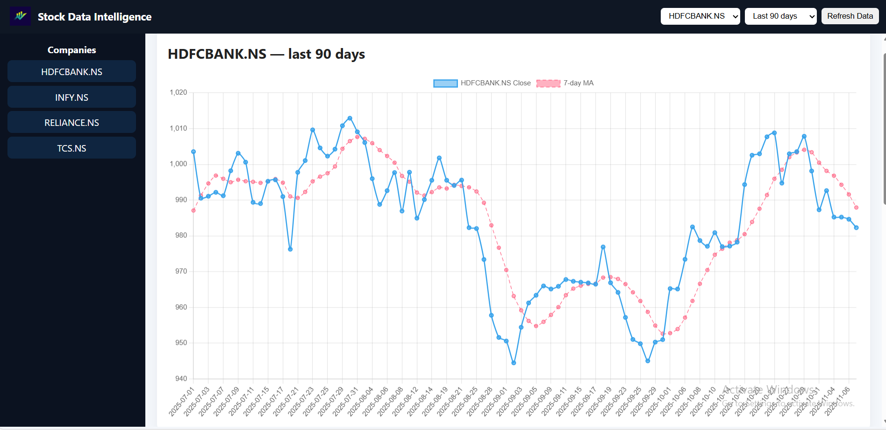
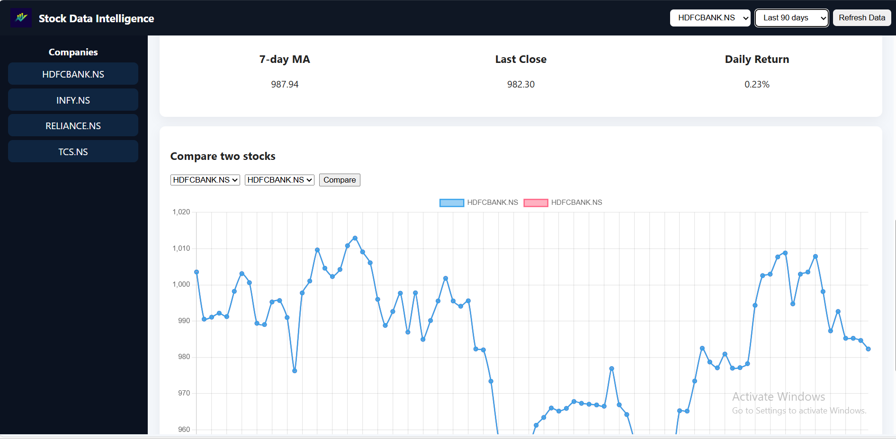
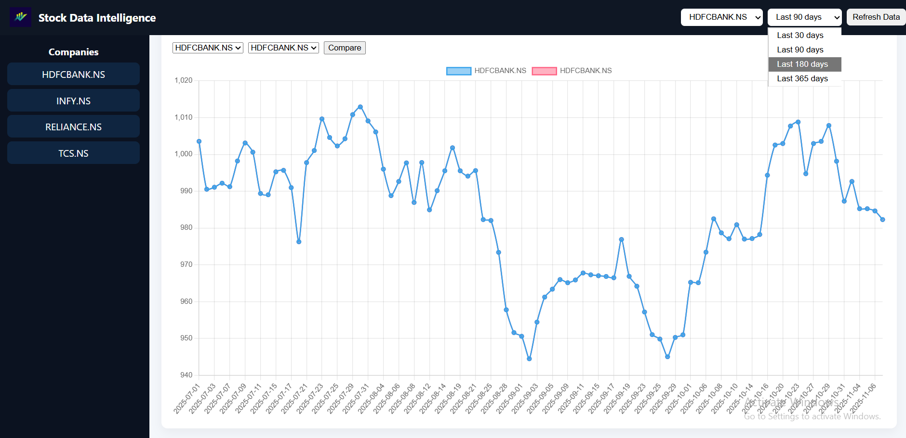

📊 Stock Data Intelligence Dashboard
- 🚀 Overview

A mini financial analytics platform built using FastAPI, SQLite, and yfinance, designed to automatically fetch, clean, and visualize stock market data.
It helps users analyze key metrics, trends, and 52-week performance insights — all in one place.
- - -
🧠 Features

- ✅ Fetch live historical stock data (using yfinance)
- ✅ Store and update records in SQLite database
- ✅ Calculate 7-day moving average & daily returns
- ✅ Interactive stock charts (Chart.js)
- ✅ Clean and modular FastAPI backend
- ✅ Auto data refresh scheduler (optional using APScheduler)

## Demo
- watch the full demo here on  [youtube] (https://youtu.be/2_BXGYa9_IU)
- you can ! [download the demo video here](Demo_video.mp4)

## Screenshots
**Dashboard:**  

🛠️ Tech Stack

Backend: FastAPI, SQLAlchemy, SQLite

Data Handling: Pandas, NumPy, yfinance

Frontend: HTML, Chart.js, Jinja2

Scheduling (optional): APScheduler

Server: Uvicorn

⚙️ Installation & Setup
# 1️⃣ Create virtual environment
python -m venv venv
source venv/bin/activate     # On Windows: venv\Scripts\activate

# 2️⃣ Install dependencies
pip install -r requirements.txt

# 3️⃣ Fetch initial data
python -m app.data_fetcher

# 4️⃣ Run the FastAPI server
uvicorn app.main:app --reload --port 8000

📍 Open in browser:
➡️ http://127.0.0.1:8000/
 — Dashboard
➡️ http://127.0.0.1:8000/docs
 — API Docs

📂 Project Structure
app/
 ├── main.py           # FastAPI app & endpoints
 ├── data_fetcher.py   # Fetches & stores stock data
 ├── models.py         # SQLAlchemy models
 ├── db.py             # Database connection
 ├── static/
 │    └── dashboard.html  # Chart.js frontend

📈 Example NSE Tickers

Use .NS suffix for NSE-listed stocks:

INFY.NS

TCS.NS

RELIANCE.NS

HDFCBANK.NS

📅 Auto Data Refresh (Optional)

To auto-update data every morning, enable APScheduler:

from apscheduler.schedulers.background import BackgroundScheduler

This will automatically run fetch_and_store() daily.

👩‍💻 Author

- Shraddha Jadhav
- 💼 Python | Django | FastAPI | Data Analytics
- 📧 shraddha9503@gmail.com

🌐 https://github.com/shraddha11953
